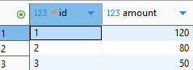
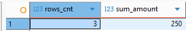
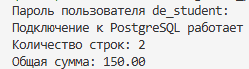

# de_project
## Назначение проекта: 
Цель работы - получить необходимые навыки для DE и собрать полноценный путь данных от источников данных до итогового проекта.


## Используемые версии инструментов:

* Python - 3.13.15
* PostgreSQL 18.6 on x86_64-windows, compiled by msvc-19.44.35228, 64-bit

## Настройка учебной базы
### Имя учебной базы 
de_course

### Команда установки зависимостей
```
python -m pip install -r requirements.txt
```
### Порядок выполнения SQL-проверки
```
sql/setup_check.py
```

### Команда запуска Python-проверки
```
python src/check_connection.py
```
***
## Путь данных
**Постановка задачи**: Интернет-магазин хранит заказы в базе данных, получает платежи через API, а возвраты выгружает в CSV. Руководителю нужен ежедневный отчёт о заказах, платежах и возвратах за предыдущий день.

1. Источники - API платежей, CSV с возвратами, данные по заказам из БД
2. Загрузка данных из источников - настройка регулярной загрузки данных в хранилище
3. Staging - промежуточный слой для предварительной подготовки данных к последующей обработке - очистка, дедубликация, приведение данных к единому виду
4. DWH - объединение и хранение согласованных данных по заказам, платежам и возвратам, выстроенные в аналитическую модель
5. Трансформации - преобразования данных, например объединение заказов и оплат по ключу, расчеты сумм и количества и прочие расчеты
6. Витрина - набор связанных таблиц с данными по конкретной предметной области для дальнейшего использования в построении отчетов
7. Отчет - сводные данные для дальнейшего анализа

Для текущей задачи предварительно выбираем **ELT** подход, т.к. можно выгрузить данные источников из БД, csv, API в базу и хранить в исходном виде, а уже после выполнять их очистку, объединение и преобразование непосредстенно в хранилище. Этот подход позволит сохранить исходную детализацию для будущих иных аналитических задач.

| Роль               | Задача        |
| ------------------ |:-------------:|
| Data Engineer      | Настройка регулярной загрузки в хранилище данных платежей через API, возвратов из CSV, заказов из БД |
| Analytics Engineer | Построение модели данных хранилища и подготовка витрины интернет-магазина|
| Data Analyst       | Формирование требований к показателям и построение ежедневного отчета на основе витрины |

**Вопросы для уточнения инженером:**
* У разработчика API платежей: Время готовности источников к загрузке, частота обновления, инкремент или фулл, атрибутный состав и типы данных, pk
* У бизнеса: что именно считать заказом, платежом и возвратом, трактовка статусов, содержание и зерно отчета, период отчетного дня, время, к которому нужна итоговая отчетность


### Процесс подготовки поставки:
1. Изменения разрабатываются на DEV-контуре. 
2. Далее проводится тестирование определенной версии решения на TEST-контуре. 
3. После того, как поставка проходит тестирование, она переносится на PROD

Разделение сред позволяет исключить возможное негативное влияние на регламентные процессы на PROD и безболезненно откатить версию до стабильной в случаях, когда это необходимо. Для учебной работы достаточно доступа к DEV/TEST, т.к. среды (в идеале) содержат один и тот же набор инструментов, а так же достаточный для тестирования подготовленный набор данных, а основная цель обучения - разработка и проверка решения.

## Результаты проверки
```
select * 
from training.homework_payments
order by id
```


```
select 
	  count(*) as rows_cnt
	, sum(amount) as sum_amount
from training.homework_payments
```


```
python src/check_connection.py
```
