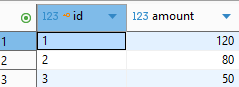
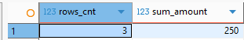
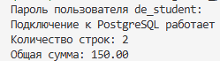
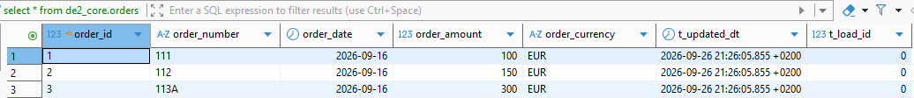
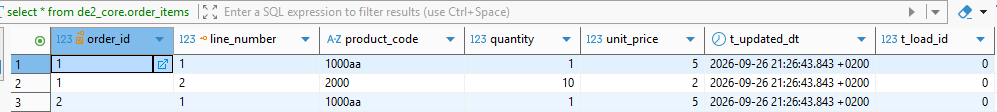
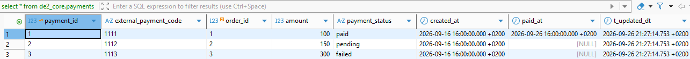

# de_project
## Назначение проекта: 
Цель работы - получить необходимые навыки для DE и собрать полноценный путь данных от источников данных до итогового проекта.


## Используемые версии инструментов:

* Python - 3.13.15
* PostgreSQL 18.6 on x86_64-windows, compiled by msvc-19.44.35228, 64-bit

## Настройка учебной базы
### Имя учебной базы 
de_course

### Команда установки зависимостей
```
python -m pip install -r requirements.txt
```
### Порядок выполнения SQL-проверки
```
sql/setup_check.sql
sql/homework_payments.sql
```

### Команда запуска Python-проверки
```
python src/check_connection.py
```
***
## Путь данных
**Постановка задачи**: Интернет-магазин хранит заказы в базе данных, получает платежи через API, а возвраты выгружает в CSV. Руководителю нужен ежедневный отчёт о заказах, платежах и возвратах за предыдущий день.

1. Источники - API платежей, CSV с возвратами, данные по заказам из БД
2. Загрузка данных из источников - настройка регулярной загрузки данных в хранилище
3. Staging - промежуточный слой для предварительной подготовки данных к последующей обработке - очистка, дедубликация, приведение данных к единому виду
4. DWH - объединение и хранение согласованных данных по заказам, платежам и возвратам, выстроенные в аналитическую модель
5. Трансформации - преобразования данных, например объединение заказов и оплат по ключу, расчеты сумм и количества и прочие расчеты
6. Витрина - набор связанных таблиц с данными по конкретной предметной области для дальнейшего использования в построении отчетов
7. Отчет - сводные данные для дальнейшего анализа

Для текущей задачи предварительно выбираем **ELT** подход, т.к. можно выгрузить данные источников из БД, csv, API в базу и хранить в исходном виде, а уже после выполнять их очистку, объединение и преобразование непосредстенно в хранилище. Этот подход позволит сохранить исходную детализацию для будущих иных аналитических задач.

| Роль               | Задача        |
| ------------------ |:-------------:|
| Data Engineer      | Настройка регулярной загрузки в хранилище данных платежей через API, возвратов из CSV, заказов из БД |
| Analytics Engineer | Построение модели данных хранилища и подготовка витрины интернет-магазина|
| Data Analyst       | Формирование требований к показателям и построение ежедневного отчета на основе витрины |

**Вопросы для уточнения инженером:**
* У разработчика API платежей: Время готовности источников к загрузке, частота обновления, инкремент или фулл, атрибутный состав и типы данных, pk
* У бизнеса: что именно считать заказом, платежом и возвратом, трактовка статусов, содержание и зерно отчета, период отчетного дня, время, к которому нужна итоговая отчетность


### Процесс подготовки поставки:
1. Изменения разрабатываются на DEV-контуре. 
2. Далее проводится тестирование определенной версии решения на TEST-контуре. 
3. После того, как поставка проходит тестирование, она переносится на PROD

Разделение сред позволяет исключить возможное негативное влияние на регламентные процессы на PROD и безболезненно откатить версию до стабильной в случаях, когда это необходимо. Для учебной работы достаточно доступа к DEV/TEST, т.к. среды (в идеале) содержат один и тот же набор инструментов, а так же достаточный для тестирования подготовленный набор данных, а основная цель обучения - разработка и проверка решения.

## Результаты проверки
```
select * 
from training.homework_payments
order by id
```


```
select 
	  count(*) as rows_cnt
	, sum(amount) as sum_amount
from training.homework_payments
```


```
python src/check_connection.py
```


***
# Неделя 2 - SQL для Data Engineering
## Задание 1 - Подключение нового магазина
| Схема      | Назначение    |
| -----------|:-------------:|
| de2_raw    | Исходные данные источников |
| de2_core   | Слой промежуточных данных |
| de2_mart   | Слой витрин |

### Создание схем и объектов
```
sql/week_02/task_01_ddl.sql
```
### Проверка вставки данных
```
sql/week_02/task_01_check.sql
```
#### Успешная вставка:




#### Ошибки:
1. Повтор order_number
```sql
insert into de2_core.orders (order_number, order_date, order_amount, order_currency, t_updated_dt, t_load_id) values
	('111', '2026-09-16', 100, 'EUR', current_timestamp, 0)
```
При повторе order_number происходит нарушение ограничения на уникальность атрибута order_number:
> SQL Error [23505]: ОШИБКА: повторяющееся значение ключа нарушает ограничение уникальности "orders_order_number_key"<br />
>  Detail: Ключ "(order_number)=(111)" уже существует.<br />
> Error position:
***
2. Платеж без существующего заказа
```sql
insert into de2_core.payments (external_payment_code, order_id, amount, payment_status, created_at, paid_at, t_updated_dt, t_load_id) values 
	('123', 999, 1, 'pending', '2026-09-16 14:00:00+00', null, current_timestamp, 0)
```
При записи платежа без существующего заказа происходит нарушение внешней связи с таблицей orders:
>SQL Error [23503]: ОШИБКА: INSERT или UPDATE в таблице "payments" нарушает ограничение внешнего ключа "fk_payments_x_order" <br />
>  Detail: Ключ (order_id)=(999) отсутствует в таблице "orders".

***
3. quantity = 0
```sql
insert into de2_core.order_items (order_id, line_number, product_code, quantity, unit_price, t_updated_dt, t_load_id) values
	(1, 1, '3000', 0, 5, current_timestamp, 0)
```
При записи деталей заказа с нулевым количеством товара происходит нарушения правила проверки корректности заполнения атрибута, по которому допустимы только значения больше 0:
>SQL Error [23514]: ОШИБКА: новая строка в отношении "order_items" нарушает ограничение-проверку "c_order_item_valid_quantity"<br />
>  Detail: Ошибочная строка содержит (1, 1, 3000, 0, 5.00, 2026-09-26 21:41:54.377281+02, 0).<br />
***
4. статус paid без paid_at
```sql
insert into de2_core.payments (external_payment_code, order_id, amount, payment_status, created_at, paid_at, t_updated_dt, t_load_id) values 
	('123', 1, 1, 'paid', '2026-09-16 14:00:00+00', null, current_timestamp, 0)
```
Происходит нарушение правила проверки, по которому дата paid_at должна заполняться только только для статуса paid и не должна только для статусов failed и pending:
>SQL Error [23514]: ОШИБКА: новая строка в отношении "payments" нарушает ограничение-проверку "c_payments_valid_paid_at"<br />
>  Detail: Ошибочная строка содержит (5, 123, 1, 1.00, paid, 2026-09-16 16:00:00+02, null, 2026-09-26 21:43:07.23593+02, 0).<br />


### Q&A
| Вопрос     | Ответ    |
| -----------|:-------------:|
| Почему суррогатный ключ не заменяет уникальность бизнес-кода? | Они имеют разные смыслы: бизнес-код определяет уникальность события с точки зрения бизнес-логики, тогда как суррогатный ключ определяет уникальную запись в базе и имеет технический характер. |
| Почему order_id не должен быть уникальным в таблице payments? | Одному заказу может соответствовать несколько событий оплаты - в случае нескольких успешных и неуспешных попыток, в случае разбивки оплаты на несколько платежей и т.д. |

## Задание 2 - Контроль входной поставки
```
sql/week_02/task_02.sql
```
#### Количество результатов по каждому rule_code, общее количество результатов и количество различных delivery_id
|rule_code|cnt_rule|cnt_total|cnt_uq_delivery_id|
|---------|--------|---------|------------------|
|duplicate_key|8|22|21|
|future_date|1|22|21|
|invalid_amount|4|22|21|
|invalid_status|1|22|21|
|paid_before_created|1|22|21|
|required_fields|4|22|21|
|status_date_mismatch|2|22|21|
|unknown_order|1|22|21|

#### Подробный реестр
|delivery_id|source_system|payment_id|rule_code|
|-----------|-------------|----------|---------|
|1|gate_a|4001|duplicate_key|
|2|gate_a|4001|duplicate_key|
|3|gate_a|4002|duplicate_key|
|4|gate_a|4002|duplicate_key|
|6|gate_a|4004|unknown_order|
|7|gate_a||invalid_amount|
|7|gate_a||required_fields|
|8|gate_a|4005|invalid_amount|
|9|gate_a|4006|invalid_status|
|10|gate_a|4007|status_date_mismatch|
|11|gate_a|4008|paid_before_created|
|12|gate_a|4009|required_fields|
|13|gate_a|4010|required_fields|
|14|gate_a|4011|future_date|
|16|gate_a|4013|duplicate_key|
|17|gate_a|4013|duplicate_key|
|19|gate_a|4014|required_fields|
|20|gate_a|4015|status_date_mismatch|
|21|gate_a|4016|invalid_amount|
|22|gate_a|4017|invalid_amount|
|23|gate_a|4018|duplicate_key|
|24|gate_a|4018|duplicate_key|

### Q&A
| Вопрос     | Ответ    |
| -----------|:-------------:|
| Почему число результатов проверок может быть больше числа проверенных записей с замечаниями? | Одна и та же запись может провалить сразу несколько непротиворечащих друг другу проверок КД |
| Какие повторы требуют выбора версии? | Выбора версии требуют записи, которые не прошли проверку на дубликаты по бизнес-ключу, т.к. это могут быть задублированные данные или долеты обновлений|
| Какие правила выявляют недопустимое содержимое?| invalid_amount, invalid_status, future_date, paid_before_created, status_date_mismatch, а также unknown_order - отсутствие связности между данными, когда в дочернюю таблицу попали идентификаторы, которых нет в родительской |

## Задание 3 - Куда исчезли платежи
```
sql/week_02/task_03.sql
```
#### Таблица контроля по этапам
|stage|row_count|total_amount|
|-----|---------|------------|
|payments|18|1740.00|
|payments+orders|17|1685.00|
|payments+orders+customers|16|1575.00|

#### Полная обогащенная выгрузка
|payment_id|order_id|amount|payment_status|customer_id|customer_name|
|----------|--------|------|--------------|-----------|-------------|
|3001|2001|120.00|paid|101|Альфа|
|3002|2001|80.00|paid|101|Альфа|
|3003|2002|120.00|pending|101|Альфа|
|3004|2003|90.00|paid|102|Вектор|
|3005|2004|100.00|paid|102|Вектор|
|3006|2004|100.00|paid|102|Вектор|
|3007|2005|70.00|failed|103|Орион|
|3008|2006|200.00|paid|103|Орион|
|3009|2006|100.00|paid|103|Орион|
|3010|2007|30.00|paid|104|Линия|
|3011|2008|40.00|paid|105|Сфера|
|3012|2009|180.00|pending|106|Маяк|
|3013|2010|110.00|paid|999||
|3014|2011|125.00|paid|104|Линия|
|3015|2999|55.00|paid|||
|3016|2002|120.00|paid|101|Альфа|
|3017|2001|15.00|failed|101|Альфа|
|3018|2012|85.00|paid|106|Маяк|

#### Контроль собранных данных
|row_count|payment_count|total_amount|
|---------|-------------|------------|
|18|18|1740.00|


#### Несопоставленные операции
|payment_id|missing_object|missing_id|
|----------|--------------|----------|
|3013|customer_id|999|
|3015|order_id|2999|

### Q&A
>Какие ограничения или проверки нужны на стороне справочников, чтобы LEFT JOIN сохранял по одной строке на платёж? Почему непустой customer_id ещё не доказывает, что клиент существует?

По одной строке на платеж по результатам left join будет сохраняться в том случае, если оплата относится к одному заказу, заказ относится к одному клиенту, в иных случаях записи будут множиться.<br /> 
Может быть ситуация, когда customer_id заполнен в orders, но клиент отсутствует в customers (к примеру, в источнике данные клиента были по какой-то причине удалены/не были загружены в базу) - это нарушение связности по внешнему ключу.


## Задание 4 - Отчёт завысил поступления
```
sql/week_02/task_04.sql
```
#### Размноженные данные
|order_id|rows_cnt|total_cst|paid_amount_direct|
|--------|--------|---------|------------------|
|2001|4|400.00|400.00|
|2002|1|120.00|120.00|
|2003|1|90.00|90.00|
|2004|4|300.00|400.00|
|2005|1|70.00||
|2006|4|600.00|600.00|
|2007|1|30.00|30.00|
|2008|1|40.00|40.00|
|2009|2|180.00||
|2010|1|110.00|110.00|
|2011|2|125.00|250.00|
|2012|1|85.00|85.00|

#### Агрегат с корректными суммами, одна строка = один заказ
|order_id|order_amount|item_count|items_amount|paid_count|paid_amount|balance_amount|
|--------|------------|----------|------------|----------|-----------|--------------|
|2001|200.00|2|200.00|2|200.00|0.00|
|2002|120.00|1|120.00|1|120.00|0.00|
|2003|90.00|1|90.00|1|90.00|0.00|
|2004|150.00|2|150.00|2|200.00|-50.00|
|2005|70.00|1|70.00|0|0|70.00|
|2006|300.00|2|300.00|2|300.00|0.00|
|2007|30.00|1|30.00|1|30.00|0.00|
|2008|40.00|1|40.00|1|40.00|0.00|
|2009|180.00|2|180.00|0|0|180.00|
|2010|110.00|1|110.00|1|110.00|0.00|
|2011|125.00|2|125.00|1|125.00|0.00|
|2012|85.00|1|85.00|1|85.00|0.00|

#### Проверка корректности витрины:
|orders_count|orders_total|items_count|items_total|paid_count|paid_total|
|------------|------------|-----------|-----------|----------|----------|
|12|1500.00|17|1500.00|13|1300.00|


#### Пример заказа с размноженными данными
|order_id|order_amount|product_code|quantity|unit_price|payment_id|paid_amount|
|--------|------------|------------|--------|----------|----------|-----------|
|2006|300.00|CHAIR|2|100.00|3008|200.00|
|2006|300.00|DESK|1|100.00|3008|200.00|
|2006|300.00|CHAIR|2|100.00|3009|100.00|
|2006|300.00|DESK|1|100.00|3009|100.00|

На один заказ order_id = 2006 в order_items приходится две позиции с общей суммой 300 EUR:
|order_id|items_amount|item_count|
|--------|------------|----------|
|2006|300.00|2|

В то же время на один заказ приходится две записи с успешной оплатой в payments:
|order_id|paid_amount|paid_count|
|--------|-----------|----------|
|2006|300.00|2|

Из-за того, что в таблицах разная гранулярность (для orders строка = один заказ, для order_items строка = одна из многих позиций в заказе, для payments строка = один факт оплаты из многих по заказу), прямое соединение без предварительной агрегации размножает записи, т.к. соединение происходит не по уникальным атрибутам. DISTINCT в таком случае не решает проблему, т.к.:
1. дубли по order_id в order_items и payments - это не дублирование данных по товарам и платежам, у этих данных другой смысл
2. при прямом соединении по дублирующимся значениям происходит cross join - получается декартово произведение, когда каждая строка соединяется с каждой строкой с таким же идентификатором, получается количество комбинаций 1 (запись в orders) * 2 (order_items) * 2 (payments) = 4 строки

Для корректного результата необходимо предварительно сгруппировать данные по позициям и платежам до той же гранулярности, что и в заказе, т.е. до одного заказа - по order_id, тогда соединение даст правильный результат и записи не будут замножены.

## Задание 5 - Поздняя доставка старой записи
```
sql/week_02/task_05.sql
```
#### Актуальная версия-1
|delivery_id|source_system|payment_id|order_id|amount|payment_status|created_on|paid_on|source_updated_at|loaded_at|
|-----------|-------------|----------|--------|------|--------------|----------|-------|-----------------|---------|
|2|gate_a|4001|2001|120.00|paid|2026-09-14|2026-09-14|2026-09-14 11:00:00.000 +0200|2026-09-17 10:01:00.000 +0200|
|4|gate_a|4002|2002|120.00|paid|2026-09-14|2026-09-15|2026-09-15 11:00:00.000 +0200|2026-09-17 10:03:00.000 +0200|
|5|gate_a|4003|2003|90.00|paid|2026-09-14|2026-09-14|2026-09-14 13:00:00.000 +0200|2026-09-17 10:04:00.000 +0200|
|6|gate_a|4004|2999|55.00|paid|2026-09-16|2026-09-16|2026-09-16 12:00:00.000 +0200|2026-09-17 10:05:00.000 +0200|
|8|gate_a|4005|2005|-70.00|paid|2026-09-15|2026-09-15|2026-09-15 12:00:00.000 +0200|2026-09-17 10:07:00.000 +0200|
|9|gate_a|4006|2006|200.00|unknown|2026-09-15||2026-09-15 14:00:00.000 +0200|2026-09-17 10:08:00.000 +0200|
|10|gate_a|4007|2007|30.00|paid|2026-09-16||2026-09-16 10:00:00.000 +0200|2026-09-17 10:09:00.000 +0200|
|11|gate_a|4008|2008|40.00|paid|2026-09-16|2026-09-15|2026-09-16 11:00:00.000 +0200|2026-09-17 10:10:00.000 +0200|
|12|gate_a|4009|2009||pending|2026-09-16||2026-09-16 11:00:00.000 +0200|2026-09-17 10:11:00.000 +0200|
|13|gate_a|4010|2010|110.00|paid||2026-09-16|2026-09-16 12:00:00.000 +0200|2026-09-17 10:12:00.000 +0200|
|14|gate_a|4011|2011|125.00|paid|2026-09-18|2026-09-18|2026-09-16 15:00:00.000 +0200|2026-09-17 10:13:00.000 +0200|
|15|gate_a|4012|2012|85.00|pending|2026-09-16||2026-09-16 16:00:00.000 +0200|2026-09-17 10:14:00.000 +0200|
|17|gate_a|4013|2004|155.00|paid|2026-09-15|2026-09-15|2026-09-15 18:00:00.000 +0200|2026-09-17 10:15:00.000 +0200|
|19|gate_a|4014||60.00|paid|2026-09-16|2026-09-16|2026-09-16 14:00:00.000 +0200|2026-09-17 10:17:00.000 +0200|
|20|gate_a|4015|2008|40.00|pending|2026-09-16|2026-09-16|2026-09-16 16:00:00.000 +0200|2026-09-17 10:18:00.000 +0200|
|21|gate_a|4016|2005|0.00|failed|2026-09-15||2026-09-15 12:00:00.000 +0200|2026-09-17 10:19:00.000 +0200|
|22|gate_a|4017|2009|20000.00|paid|2026-09-16|2026-09-16|2026-09-16 17:00:00.000 +0200|2026-09-17 10:20:00.000 +0200|
|23|gate_a|4018|2007|30.00|paid|2026-09-16|2026-09-16|2026-09-16 18:00:00.000 +0200|2026-09-17 10:21:00.000 +0200|
|18|gate_b|4001|2006|100.00|paid|2026-09-16|2026-09-16|2026-09-16 13:00:00.000 +0200|2026-09-17 10:16:00.000 +0200|

#### Актуальная версия-2
|delivery_id|source_system|payment_id|order_id|amount|payment_status|created_on|paid_on|source_updated_at|loaded_at|
|-----------|-------------|----------|--------|------|--------------|----------|-------|-----------------|---------|
|2|gate_a|4001|2001|120.00|paid|2026-09-14|2026-09-14|2026-09-14 11:00:00.000 +0200|2026-09-17 10:01:00.000 +0200|
|4|gate_a|4002|2002|120.00|paid|2026-09-14|2026-09-15|2026-09-15 11:00:00.000 +0200|2026-09-17 10:03:00.000 +0200|
|5|gate_a|4003|2003|90.00|paid|2026-09-14|2026-09-14|2026-09-14 13:00:00.000 +0200|2026-09-17 10:04:00.000 +0200|
|6|gate_a|4004|2999|55.00|paid|2026-09-16|2026-09-16|2026-09-16 12:00:00.000 +0200|2026-09-17 10:05:00.000 +0200|
|8|gate_a|4005|2005|-70.00|paid|2026-09-15|2026-09-15|2026-09-15 12:00:00.000 +0200|2026-09-17 10:07:00.000 +0200|
|9|gate_a|4006|2006|200.00|unknown|2026-09-15||2026-09-15 14:00:00.000 +0200|2026-09-17 10:08:00.000 +0200|
|10|gate_a|4007|2007|30.00|paid|2026-09-16||2026-09-16 10:00:00.000 +0200|2026-09-17 10:09:00.000 +0200|
|11|gate_a|4008|2008|40.00|paid|2026-09-16|2026-09-15|2026-09-16 11:00:00.000 +0200|2026-09-17 10:10:00.000 +0200|
|12|gate_a|4009|2009||pending|2026-09-16||2026-09-16 11:00:00.000 +0200|2026-09-17 10:11:00.000 +0200|
|13|gate_a|4010|2010|110.00|paid||2026-09-16|2026-09-16 12:00:00.000 +0200|2026-09-17 10:12:00.000 +0200|
|14|gate_a|4011|2011|125.00|paid|2026-09-18|2026-09-18|2026-09-16 15:00:00.000 +0200|2026-09-17 10:13:00.000 +0200|
|15|gate_a|4012|2012|85.00|pending|2026-09-16||2026-09-16 16:00:00.000 +0200|2026-09-17 10:14:00.000 +0200|
|17|gate_a|4013|2004|155.00|paid|2026-09-15|2026-09-15|2026-09-15 18:00:00.000 +0200|2026-09-17 10:15:00.000 +0200|
|19|gate_a|4014||60.00|paid|2026-09-16|2026-09-16|2026-09-16 14:00:00.000 +0200|2026-09-17 10:17:00.000 +0200|
|20|gate_a|4015|2008|40.00|pending|2026-09-16|2026-09-16|2026-09-16 16:00:00.000 +0200|2026-09-17 10:18:00.000 +0200|
|21|gate_a|4016|2005|0.00|failed|2026-09-15||2026-09-15 12:00:00.000 +0200|2026-09-17 10:19:00.000 +0200|
|22|gate_a|4017|2009|20000.00|paid|2026-09-16|2026-09-16|2026-09-16 17:00:00.000 +0200|2026-09-17 10:20:00.000 +0200|
|24|gate_a|4018|2007|35.00|paid|2026-09-16|2026-09-16|2026-09-16 17:00:00.000 +0200|2026-09-17 10:22:00.000 +0200|
|18|gate_b|4001|2006|100.00|paid|2026-09-16|2026-09-16|2026-09-16 13:00:00.000 +0200|2026-09-17 10:16:00.000 +0200|

#### Список неполных ключей
|delivery_id|source_system|payment_id|order_id|amount|payment_status|created_on|paid_on|source_updated_at|loaded_at|
|-----------|-------------|----------|--------|------|--------------|----------|-------|-----------------|---------|
|7|gate_a||2004|-50.00|paid|2026-09-15|2026-09-15|2026-09-15 10:00:00.000 +0200|2026-09-17 10:06:00.000 +0200|

#### Не попали в актуальные версии в варианте 1
|delivery_id|source_system|payment_id|order_id|amount|payment_status|created_on|paid_on|source_updated_at|loaded_at|rn|
|-----------|-------------|----------|--------|------|--------------|----------|-------|-----------------|---------|--|
|1|gate_a|4001|2001|120.00|paid|2026-09-14|2026-09-14|2026-09-14 11:00:00.000 +0200|2026-09-17 10:00:00.000 +0200|2|
|3|gate_a|4002|2002|100.00|pending|2026-09-14||2026-09-14 14:00:00.000 +0200|2026-09-17 10:02:00.000 +0200|2|
|16|gate_a|4013|2004|150.00|paid|2026-09-15|2026-09-15|2026-09-15 18:00:00.000 +0200|2026-09-17 10:15:00.000 +0200|2|
|24|gate_a|4018|2007|35.00|paid|2026-09-16|2026-09-16|2026-09-16 17:00:00.000 +0200|2026-09-17 10:22:00.000 +0200|2|

#### Не попали в актуальные версии в варианте 2
|delivery_id|source_system|payment_id|order_id|amount|payment_status|created_on|paid_on|source_updated_at|loaded_at|rn|
|-----------|-------------|----------|--------|------|--------------|----------|-------|-----------------|---------|--|
|1|gate_a|4001|2001|120.00|paid|2026-09-14|2026-09-14|2026-09-14 11:00:00.000 +0200|2026-09-17 10:00:00.000 +0200|2|
|3|gate_a|4002|2002|100.00|pending|2026-09-14||2026-09-14 14:00:00.000 +0200|2026-09-17 10:02:00.000 +0200|2|
|16|gate_a|4013|2004|150.00|paid|2026-09-15|2026-09-15|2026-09-15 18:00:00.000 +0200|2026-09-17 10:15:00.000 +0200|2|
|23|gate_a|4018|2007|30.00|paid|2026-09-16|2026-09-16|2026-09-16 18:00:00.000 +0200|2026-09-17 10:21:00.000 +0200|2|

#### Сравнение двух способов сортировки и исходных данных
|stage|total_rows_count|pk_doubles_count|
|-----|----------------|----------------|
|original|24|4|
|var1|19|0|
|var2|19|0|

>Почему время получения не определяет актуальность версии? Зачем source_system входит в ключ? Какие поля определяют выбор при полностью совпавших временных метках?

Могут возникать долеты старых данных, к примеру, когда один из источников не был доступен и данные были выгружены с опозданием. source_system входит в ключ для того, чтобы была возможность однозначно определить запись, т.к. идентификаторы оплаты могут пересекаться между источниками. При полностью совпавших временных метках выбор доопределяется по идентификатору доставки.


## Задание 6 - Подготовка дневных поступлений
```
sql/week_02/task_06.sql
```
1. Получите дневной результат paid_on, payment_count, paid_amount, отсортированный по дате. Показывайте только дни с подходящими платежами.

|paid_on|payment_count|payment_amount|
|-------|-------------|--------------|
|2026-09-14|2|210.00|
|2026-09-15|2|275.00|
|2026-09-16|2|130.00|

2. С теми же CTE выведите контроль для source_rows, keyed, latest, valid, paid, matched: stage, row_count, amount_count, total_amount. amount_count означает COUNT(amount). SUM не заменяйте нулём автоматически.

|stage|row_count|amount_count|total_amount|
|-----|---------|------------|------------|
|1 source_rows|24|23|21645.00|
|2 keyed|23|22|21695.00|
|3 latest|19|18|21290.00|
|4 valid|8|8|755.00|
|5 paid|7|7|670.00|
|6 matched|6|6|615.00|

3. Подготовьте журнал исключений delivery_id, excluded_at. Для каждого перехода верните строки, бывшие на входе, но отсутствующие на выходе. Каждая исключённая доставка должна быть указана один раз - на первом исключившем её этапе.

|delivery_id|excluded_at|
|-----------|-----------|
|1|3 latest|
|3|3 latest|
|6|6 matched|
|7|2 keyed|
|8|4 valid|
|9|4 valid|
|10|4 valid|
|11|4 valid|
|12|4 valid|
|13|4 valid|
|14|4 valid|
|15|5 paid|
|16|3 latest|
|19|4 valid|
|20|4 valid|
|21|4 valid|
|22|4 valid|
|24|3 latest|

4. Сверьте SUM(payment_count) дневного результата с числом строк matched, а SUM(paid_amount) - с суммой matched.amount.

|daily_rows_cnt|matched_rows_cnt|diff_rows_cnt|daily_payment_amt|matched_payment_amt|diff_payment_amt|
|--------------|----------------|-------------|-----------------|-------------------|----------------|
|6|6|0|615.00|615.00|0.00|

> Почему после выбора версий сумма может уменьшиться или увеличиться? Как отличить ожидаемое изменение количества строк от потери данных при соединении?

В зависимости от выбранного способа сортировки в итоговый результат могут попасть записи с разными суммами, т.к. в нашем примере оба варианта сортировки никак не зависят от amount. Также при переходе от всех доставок к актуальным версиям сумма меняется из-за удаления невыбранных строк. В данном наборе исключаются суммы 120, 100, 150 и 35 EUR, всего 405 EUR. Если бы исключались отрицательные значения, общая сумма могла бы увеличиться. <br /> 
Для того, чтобы отличить ожидаемое изменение количества строк от потери данных при джойне стоит помимо результата джойна проверить те записи, которые не сопоставились при соединении - это даст точное понимание, какая часть данных не попала, и возможность отловить некоторые явные паттерны, из-за которых данные могли отвалиться.

## Задание 7 - История оплат и рейтинг заказов
```
sql/week_02/task_07.sql
```
Подробная история с оконными показателями

|order_id|payment_id|paid_at|amount|previous_amount|next_amount|amount_change|running_amount|
|--------|----------|-------|------|---------------|-----------|-------------|--------------|
|2001|3001|2026-09-14 11:00:00.000 +0200|120.00||80.00||120.00|
|2001|3002|2026-09-14 12:00:00.000 +0200|80.00|120.00||-40.00|200.00|
|2003|3004|2026-09-14 13:00:00.000 +0200|90.00||||90.00|
|2004|3005|2026-09-15 10:00:00.000 +0200|100.00||100.00||100.00|
|2004|3006|2026-09-15 10:00:00.000 +0200|100.00|100.00||0.00|200.00|
|2006|3008|2026-09-15 14:00:00.000 +0200|200.00||100.00||200.00|
|2006|3009|2026-09-16 11:00:00.000 +0200|100.00|200.00||-100.00|300.00|
|2007|3010|2026-09-16 12:00:00.000 +0200|30.00||||30.00|
|2008|3011|2026-09-16 13:00:00.000 +0200|40.00||||40.00|
|2010|3013|2026-09-16 14:00:00.000 +0200|110.00||||110.00|
|2011|3014|2026-09-16 15:00:00.000 +0200|125.00||||125.00|

Полный рейтинг заказов
|order_id|paid_amount|amount_rank|amount_dense_rank|
|--------|-----------|-----------|-----------------|
|2006|300.00|1|1|
|2001|200.00|2|2|
|2004|200.00|2|2|
|2011|125.00|4|3|
|2010|110.00|5|4|
|2003|90.00|6|5|
|2008|40.00|7|6|
|2007|30.00|8|7|

Две наибольшие различные суммы заказов
|order_id|paid_amount|amount_rank|amount_dense_rank|
|--------|-----------|-----------|-----------------|
|2006|300.00|1|1|
|2001|200.00|2|2|
|2004|200.00|2|2|

>Почему для накопительной суммы нужен дополнительный ключ payment_id, а для равенства мест рейтинга он не должен входить в ORDER BY внутри OVER? <br /> 

Для накопительной суммы важно учитывать порядок платежей, и payment_id доопределяет сортировку. Для равенства мест рейтинга он не нужен, т.к. рассматривается уже сумма платежей.

>Почему в последнем результате может быть больше двух строк?<br /> 

Важным условием является вывести заказы с двумя наибольшими суммами, а не два наибольших заказа; несколько разных заказов могут быть на одну и ту же сумму платежей.

## Задание 8 - Суммы совпали. Можно публиковать?
```
sql/week_02/task_08.sql
```
1. Проверка уникальности ключей:

|source|count|count|sum|
|------|-----|-----|---|
|ledger_before|6|6|700.00|
|ledger_after|6|6|700.00|

2. Сверка

|lb_payment_id|la_payment_id|before_amount|after_amount|before_currency|after_currency|before_paid_on|after_paid_on|missing_after|new_after|amount_changed|currency_changed|date_changed|
|-------------|-------------|-------------|------------|---------------|--------------|--------------|-------------|-------------|---------|--------------|----------------|------------|
|5001|5001|100.00|100.00|EUR|EUR|2026-09-14|2026-09-14|false|false|false|false|false|
|5002|5002|150.00|160.00|EUR|EUR|2026-09-14|2026-09-14|false|false|true|false|false|
|5003|5003|200.00|200.00|EUR|EUR|2026-09-15|2026-09-16|false|false|false|false|true|
|5004|5004|80.00|80.00|EUR|EUR|2026-09-15|2026-09-15|false|false|false|false|false|
|5005||120.00||EUR||2026-09-16||true|false|false|false|false|
|5006|5006|50.00|50.00|EUR|EUR|2026-09-16|2026-09-16|false|false|false|false|false|
||5007||110.00||EUR||2026-09-16|false|true|false|false|false|

3. Расхождения

|payment_id|before_amount|after_amount|before_currency|after_currency|before_paid_on|after_paid_on|missing_after|new_after|amount_changed|currency_changed|date_changed|
|----------|-------------|------------|---------------|--------------|--------------|-------------|-------------|---------|--------------|----------------|------------|
|5002|150.00|160.00|EUR|EUR|2026-09-14|2026-09-14|false|false|true|false|false|
|5003|200.00|200.00|EUR|EUR|2026-09-15|2026-09-16|false|false|false|false|true|
|5005|120.00||EUR||2026-09-16||true|false|false|false|false|
|5007||110.00||EUR||2026-09-16|false|true|false|false|false|

4. Решение о публикации - не допущено, требует исправления ошибок

Нарушены следующие требования: поменялись ключи (пропала одна старая запись и появилась одна новая), есть расхождения в суммах и датах платежей.<br /> 
Необходимо проверить следующие ключи:<br /> 
payment_id = 5002 - изменилась сумма платежа 150.00	-> 160.00<br /> 
payment_id = 5003 - изменилась дата платежа 2026-09-15 -> 2026-09-16<br /> 
payment_id = 5005 - запись пропала<br /> 
payment_id = 5007 - новая запись, есть вероятность, что это "поехавшая" запись для 5005, но не совпадают суммы платежей - требуется проверить, откуда появилась запись<br /> 
Ожидаемый результат после исправления: восстановление записи payment_id = 5005 со значениями 120 EUR и датой 2026-09-16, отсутствие лишней записи payment_id = 5007, сумма 150 EUR для payment_id = 5002 и дата 2026-09-15 для payment_id = 5003. Сверка после исправления ошибок не выдает расхождений с исходным регистром.<br /> 

> Почему одинаковые количество строк и сумма не доказывают корректность переноса? Какие две разные ошибки могут компенсировать друг друга в общей сумме?<br /> 
К примеру, может оказаться, что для одной строки увеличена сумма платежа, в другой - уменьшена на то же значение, либо съехали ключи, но значения остальных атрибутов остались, и итоговый результат в итоге компенсируется. Для того, чтобы однозначно определить корректность переноса, лучше проводить поатрибутную сверку, чтобы точно определить, есть ли расхождения по ключам и по значениям атрибутов.